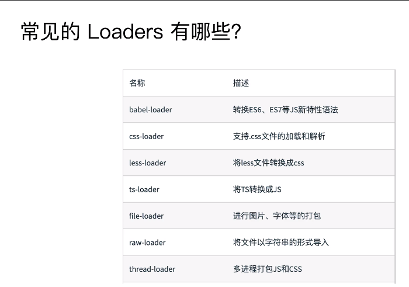
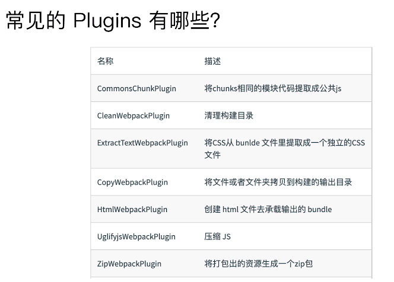
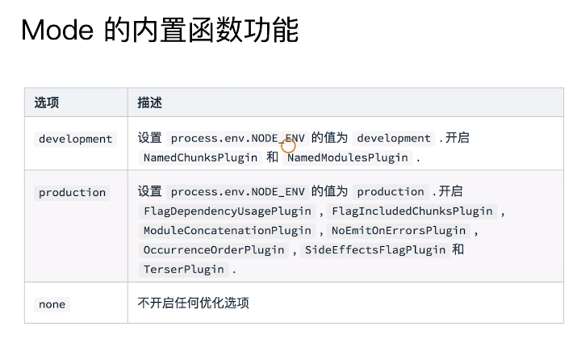
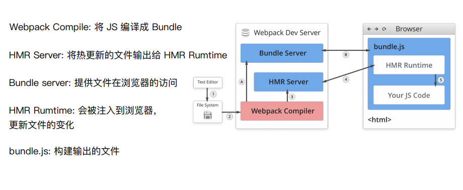

## 1.webpack 基础用法

### 1.依赖入口是entry

entry可分为单入口和多入口，单入口下entry为一个字符串，多入口下entry是一个对象，对象中有入口文件的key和value
```javascript
module.exports = {
    entry: './path/to/my/entry/file.js'
};

module.exports = {
    entry: {
        app: './src/app.js',
        adminApp: './src/adminApp.js'
    }
};
 ```

 ### 2.Output告诉webpack如何将编译后的文件输出到磁盘
会在path目录下创建bundle.js文件，里面是编译后的文件
```javascript
module.exports = {
    entry: {
        //
    },
    output: {
        path: path.join(__dirname, 'dist'),
        filename: 'bundle.js'
    }
}
```
 ### 3.Loaders帮忙加载除js和json之外的文件



```javascript
module.exports = {
    entry: {
        //
    },
    output: {
       //
    },
    module: {
        rules:[
            {test: /\.txt$/, use: 'raw-loader'}
        ]
    }
};
```
test制定了匹配规则，use指定使用的loader名称

### 4.Plugins帮忙做Loaders做不到的事

```javascript
module.exports = {
    entry: {
        //
    },
    output: {
       //
    },//plugins是一个数组
    plugins: [
        new HtmlWebpackPlugin({templte: './src/index.html'})
    ]
};
```
### 5.mode配置开发环境 production development


### 6.解析ES6和jsx

解析es6语法需要执行命令安装`npm install @babel/core @babel/preset-env babel-loader -D`，安装完成后在根目录文件下创建.babelrc，并填写
```javascript
{
    "presets": [
        "@babel/preset-env"
    ]
}
```
在webpack.config.js的module中新增
```javascript
module: {
    rules: [
        {
            test: /.js$/,
            use: 'babel-loader'
        }
    ]
}
```
解析jsx语法需要执行安装命令`npm install react react-dom @babel/preset-react -D`,在babelrc文件中添加
```javascript
{
    "presets": [
        "@babel/preset-env",
        "@babel/preset-react"
    ]
}
```

### 7.解析css和less

执行命令`npm i css-loader style-loader -D`和`npm i less less-loader -D`，并在`webpack.config.js module`分别配置rules
```javascript
module: {
        rules: [
            {
                test: /.js$/,
                use: 'babel-loader'
            },
            {
                test: /.css$/,
                use: [
                    'style-loader',
                    'css-loader'
                ]
            },
            {
                test:/.less$/,
                use: [
                    'style-loader',
                    'css-loader',
                    'less-loader'
                ]
            }
        ]
    },
```

### 8.解析图片 file-loader url-loader
```javascript
{
                test: /\.(png|jpg|gif)$/,
                use: [
                    {
                        loader: 'url-loader',
                        options: {
                            limit: 10240
                        }
                    }
                ]
            },
            {
                test: /.(woff|woff2|eot|ttf|otf)$/,
                use: 'file-loader'
            }
```
### 9.文件监听
文件源码在发生变化的时候，自动重建构建新的输出文件
1.在启动webpack的时候带上`--watch`参数
2.在配置`webpack.config.js`的时候设置`watch:true`
示例：
在`package.json script`中添加` "watch": "webpack --watch"`,启动之后webpack会对文件的修改进行监听，但这种方式需要手动刷新浏览器。


文件监听原理：当某个文件发生变化的时候，并不会立刻告诉监听者，而是先缓存起来
```javascript
module.export = {
    watch:true,
    watchOption: {
        ignored: /node_modules/, //忽略的监听文件，支持正则表达
        aggregateTimeout: 300, //发现更新后延迟300ms再执行
        poll: 1000 //每秒询问1000次
    }
}
```
3.使用 `webpack-dev-server`进行热更新
在`package.json`中配置
```javascript
{
    "name": "hello-webpack",
    "version": "1.0.0",
    "description": "Hello webpack",
    "main": "index.js",
    "scripts": {
    "build": "webpack ",
    "dev": "webpack-dev-server --open"
    },
    "keywords": [],
    "author": "",
    "license": "ISC"
}
```
热更新原理


### 10.文件指纹

本质是给文件后缀带上哈希码进行区别，
js文件配[chunkhash:8]
img配[hash:8][ext]
css文件配[contenthash:8]
由于css文件不能独立作为文件，需要安装插件`npm i mini-css-extract-plugin -D`
style-loader无法和mini-css-extract-plugin一起使用，所以要提取为独立文件就要用后者替换前者
```javascript
plugins: [
        new MiniCssExtractPlugin({
            filename: '[name]_[contenthash:8].css'
        }
        )
    ]
```

### 11.文件压缩

 Css压缩插件 `npm i css-minimizer-webpack-plugin -D`， 引用插件`const CSSMinimizerWebpackPlugin = require('css-minimizer-webpack-plugin');`
 安装预处理器：` npm i cssnano -D`

 Html压缩插件
插件安装Html`npm i html-webpack-plugin -D`
 ```javascript
  new HtmlWebpackPlugin({
            template: path.join(__dirname, 'src/index.html'),
            filename: 'index.html',
            chunks: ['index'],
            inject: true,
            minify: {
                html5: true,
                collapseWhitespace: true,
                preserveLineBreaks: false,
                minifyCSS: true,
                minifyJS: true,
                removeComments: false
            }
        })
 ```


