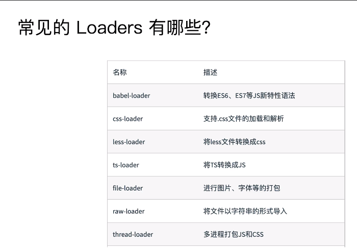
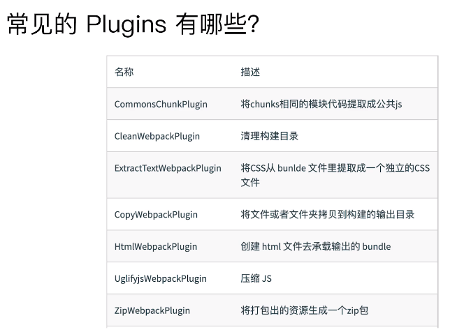
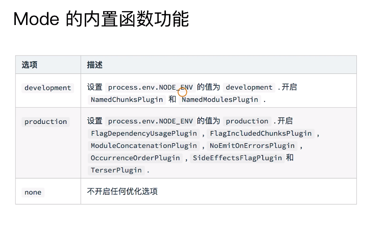

## 1.webpack 基础用法

### 1.依赖入口是entry

entry可分为单入口和多入口，单入口下entry为一个字符串，多入口下entry是一个对象，对象中有入口文件的key和value
```javascript
module.exports = {
    entry: './path/to/my/entry/file.js'
};

module.exports = {
    entry: {
        app: './src/app.js',
        adminApp: './src/adminApp.js'
    }
};
 ```

 ### 2.Output告诉webpack如何将编译后的文件输出到磁盘
会在path目录下创建bundle.js文件，里面是编译后的文件
```javascript
module.exports = {
    entry: {
        //
    },
    output: {
        path: path.join(__dirname, 'dist'),
        filename: 'bundle.js'
    }
}
```
 ### 3.Loaders帮忙加载除js和json之外的文件



```javascript
module.exports = {
    entry: {
        //
    },
    output: {
       //
    },
    module: {
        rules:[
            {test: /\.txt$/, use: 'raw-loader'}
        ]
    }
};
```
test制定了匹配规则，use指定使用的loader名称

### 4.Plugins帮忙做Loaders做不到的事

```javascript
module.exports = {
    entry: {
        //
    },
    output: {
       //
    },//plugins是一个数组
    plugins: [
        new HtmlWebpackPlugin({templte: './src/index.html'})
    ]
};
```
### 5.mode配置开发环境 production development


### 6.解析ES6和jsx

解析es6语法需要执行命令安装`npm install @babel/core @babel/preset-env babel-loader -D`，安装完成后在根目录文件下创建.babelrc，并填写
```javascript
{
    "presets": [
        "@babel/preset-env"
    ]
}
```
在webpack.config.js的module中新增
```javascript
module: {
    rules: [
        {
            test: /.js$/,
            use: 'babel-loader'
        }
    ]
}
```
解析jsx语法需要执行安装命令`npm install react react-dom @babel/preset-react -D`,在babelrc文件中添加
```javascript
{
    "presets": [
        "@babel/preset-env",
        "@babel/preset-react"
    ]
}
```


